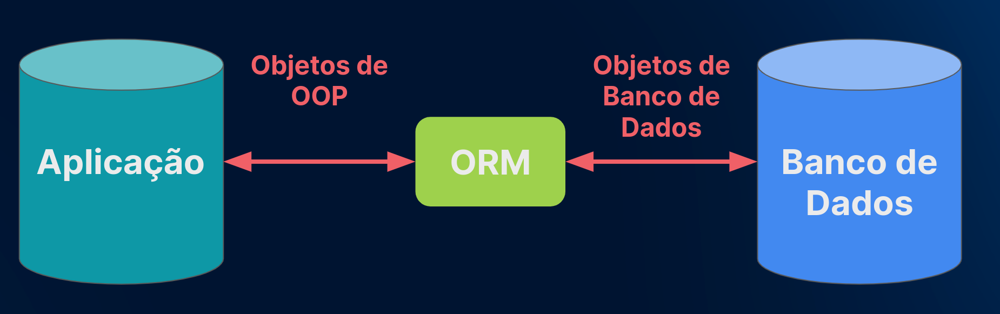

# Curso Django 4

Aplicação chamada Alura Space, usando Django e dando ênfase total ao template. Quando clicarmos nas imagens da interface, elas serão apresentadas em um tamanho maior e, abaixo delas, encontraremos um texto com seu contexto.

Trabalhando com rotas diferentes, carregar arquivos estáticos da aplicação, tornando-os específicos de um só local e a criar boas práticas de programação para evitar código duplicado.

A ênfase é em boas práticas de programação relacionadas ao template.

Usado o Django para renderizar páginas, e não para criar uma API rest. O Django é uma ótima ferramenta para fazer front-end e back-end trabalharem em sintonia.

## O que é Django
O Django é um framework escrito em Python e focado no desenvolvimento de projetos. Ele é uma espécie de "caixa de ferramentas" com várias soluções para o desenvolvimento de projetos.

A documentação dessa ferramenta o descreve como um "framework para perfeccionistas que possuem prazos". Logo, percebe-se que o Django preza por um desenvolvimento rápido, que facilita a criação de aplicações web com menos código.

Django é focado e projetado desde o início para `content-driven` (orientado a conteúdo). Se formos criar, por exemplo, um site de notícias, essa é a ferramenta ideal. Ele provê uma estrutura nativa de banco de dados. Quando damos início a um projeto, ele já nos conecta a um banco de dados automaticamente (SQLite).

Operações CRUD (criação, leitura, atualização e exclusão) também são facilitadas por essa ferramenta.

O Django foi lançado em 2005 como uma ferramenta de código aberto, e é assim até hoje. Nós não precisamos pagar uma licença para utilizá-lo: qualquer pessoa que tiver o Python instalada no seu sistema operacional pode utilizar o Django. Ele nasceu no contexto de um jornal de notícias do estado do Kansas, para dar autonomia de publicação a produtores de conteúdo.

O nome Django é uma homenagem ao guitarrista de Jazz muito famoso Django Reinaherdt.

Desde seu nascimento, portanto, a ferramenta era orientada a conteúdo.

Nós escolhemos o Django, ao invés de outra linguagem, por alguns motivos:
- Sua sintaxe é simples e objetiva.

- Ele possui, também, um ORM nativo e, por isso, não precisamos escrever código SQL manualmente. Ele é capaz de importar esses códigos.

- Além disso, a ferramenta possui uma interface de administrador incrível, que facilita atualização, edição e exclusão de conteúdos.

- O Django resiste a ataques de cross site scripting e injeções de SQL.

- Sua arquitetura é MVT:
  - **Model**: É uma estrutura lógica por trás da aplicação que vai representar como os dados vão estar se comportando no banco de dados. Como a aplicação e os dados vão interagir.
  - **View**: É similar ao Controller do MVC. É a lógica de negócio, ela recebe a requisição do usuário, processa, acessa o model se necessário e retorna uma resposta.
  - **Template** É responsável pela representação das páginas HTML.

- Outro ponto interessante do Django é o fato de que ele possui uma comunidade ativa, que contribui regularmente para a utilização contínua do framework em todo o mundo.

- A estrutura do Django também favorece seu uso. Quando criamos um projeto, já temos acesso a um banco de dados utilizável no ambiente de desenvolvimento, integração, interação entre banco de dados e modelos, migrações, língua do projeto, time zone e mais, tudo de forma nativa.

- Se o projeto que criamos exige que o front-end e o back-end esteja no mesmo lugar, o Django é uma excelente escolha, por ser uma ferramenta fullstack. Isso significa que no mesmo projeto conseguimos trabalhar tanto front-end quanto back-end.

## Ambiente Virtual

A utilização de ambientes virtuais em projetos Python é uma prática padrão no desenvolvimento de software com a linguagem. O consenso da comunidade Python de que ambientes virtuais são uma ótima prática levou à criação de vários projetos com o objetivo de oferecer versões alternativas de ambientes virtuais e novas formas de gerenciá-los.

A seguir temos alguns exemplos de ambientes virtuais e ferramentas relacionadas mais utilizadas no mercado:

- `venv`: É o ambiente virtual ?padrão? do Python e sua grande vantagem é já vir instalado como um módulo na linguagem a partir da versão 3.3. Se trata de um subset (parte menor) da ferramenta virtualenv.

- `Virtualenv`: É uma ferramenta feita especificamente para a criação de ambientes virtuais e precede a criação da venv, sendo um superset (parte maior) dela. Algumas de sua principais vantagens sobre a venv são:
  - Maior velocidade, graças ao método app-data seed;
  - Pode criar ambientes virtuais para versões arbitrárias do Python instaladas na máquina;
  - Pode ser atualizado utilizando a ferramenta pip;
  - Possui uma Programmatic API, capaz de descrever um ambiente virtual sem criá-lo.

- `Conda`: É uma alternativa não apenas às ferramentas de ambiente virtuais já citadas, mas ao instalador de pacotes pip também. Possui um escopo mais centrado na área de ciência de dados e possui a capacidade de instalar pacotes fora do ecossistema do Python.

- `Virtualenvwrapper`: É uma extensão do projeto Virtualenv que torna a criação, deleção e gerenciamento geral dos ambientes virtuais mais fácil. Uma grande vantagem de sua utilização é a organização de todos os ambientes virtuais utilizados em um só lugar, além de facilitar os comandos de CLI.

- `Poetry`: É uma ferramenta para gerenciamento de dependências e pacotes do Python. Através do Poetry é possível declarar quais pacotes um projeto necessita para funcionar, de forma parecida ao requirements.txt, porém, de forma determinística.

## DRY
o DRY, "Don't Repeat Yourself", que significa "não seja repetitivo", em português. Essa ação significa não permitir a existência de código duplicado. É importante que cada parte seja isolada.

## ORM
A tecnologia do ORM (**Object-Relational-Mapper**) se faz presente no desenvolvimento de aplicações web independentemente da linguagem utilizada para o desenvolvimento do projeto. O entendimento de seu funcionamento é essencial para um profissional da área.

Para aprender o que é um ORM basta pensar que o conceito de mapeamento relacional do objeto gira em torno da ideia de conseguirmos escrever queries em código SQL por meio do paradigma da **orientação a objetos** de uma linguagem de programação.

Isso é feito através do mapeamento dos parâmetros de um objeto e de sua tradução para a estrutura de tabelas encontradas em um RDBMS (Relational Database, Management System - Sistema de Gerenciamento de Banco de Dados Relacional).

Cada linguagem (ou mesmo framework) que suporta orientação a objetos possui um ORM de utilização mais comum:
- Python e Flask: SQLAlchemy;
- Python e Django: Django ORM;
- Java: Hibernate;
- C#: Dapper ORM;
- PHP: Doctrine;
- .NET framework : Microsoft Entity Framework.

### Vantagens da utilização de um ORM:
- Possibilita, para quem programa, construir bancos de dados utilizando sua linguagem de programação de maior fluência, sem ter que se aprofundar nas complexidades do código SQL;

- Torna a aplicação independente do RDBMS utilizado. Isso facilita uma eventual migração de banco de dados, bem como a escrita de queries genéricas que se enquadram nos mais diversos RDBMS (MySQL, PostgreSQL, Microsoft SQL Server, etc);

- A conexão entre a aplicação e o banco de dados se torna robusta, segura e menos sujeita a erros de código, uma vez que poucas intervenções de código são necessárias;

- Alguns ORM como o SQLAlchemy possuem um toolkit completo de ferramentas extras que otimizam a interação com o banco de dados.

### Desvantagens da utilização de um ORM:
- A integração de ORMs com sistemas legados pode ser problemática;

- Pode criar a ilusão, para desenvolvedores iniciantes, que não é necessária uma compreensão básica de linguagem SQL para se tornar um profissional completo de desenvolvimento de aplicações web.

A utilização de ORMs em desenvolvimento de softwares acaba sendo bem transversal em relação aos possíveis frameworks existentes, ou seja, a presença de um ORM não é específica apenas do Django, mas de outros frameworks variados como o Flask, por exemplo.

## Django ADMIN
https://docs.djangoproject.com/en/6.0/ref/contrib/admin/

